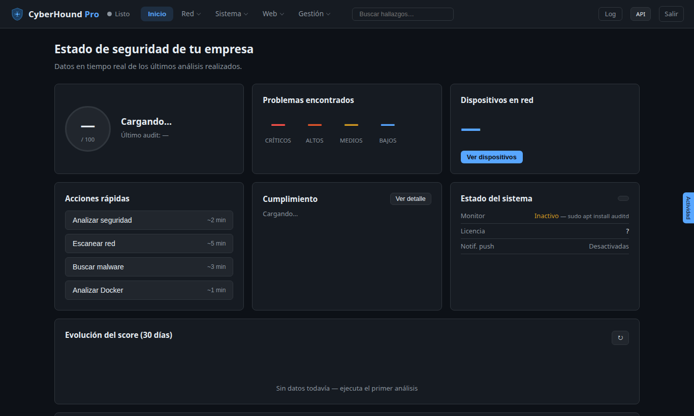
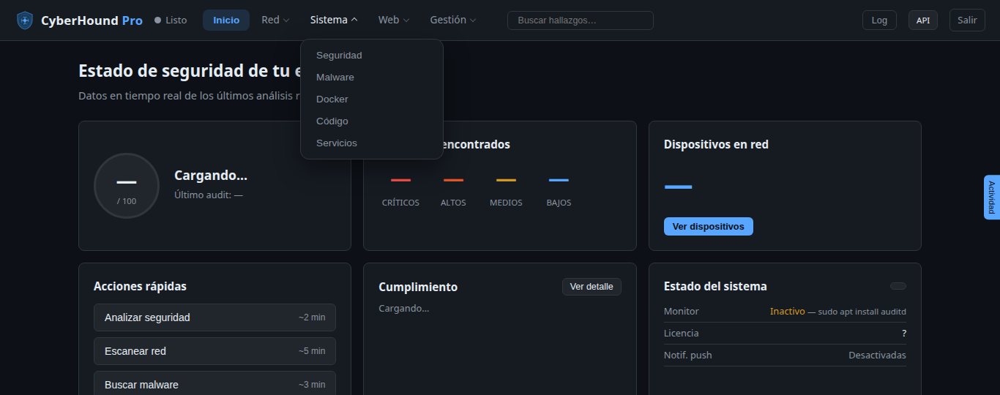

# CyberHound Pro — Manual de uso

Guía práctica para usar CyberHound en el día a día. Para instalar, ver el
[README](../README.md#instalación-rápida) y los [requisitos](../README.md#requisitos).



---

## 1. Acceder a la interfaz

```bash
sudo cyberhound web --port 8443     # con autenticación
# o, solo en local (desarrollo), sin login:
sudo cyberhound web --no-auth --host 127.0.0.1
```
Abre **https://TU_HOST:8443** (certificado autofirmado la primera vez → el
navegador avisará). Credenciales: las que fijaste con `cyberhound setup`.

> El modo `--no-auth` solo permite acceso desde `127.0.0.1` (localhost).

### Navegación

La interfaz es **responsive** (se adapta a cualquier monitor o móvil, sin scroll
lateral) y agrupa todas las funciones en cinco menús de la barra superior:



| Menú | Funciones |
|---|---|
| **Inicio** | Panel de estado (score, problemas, cumplimiento, sistema) |
| **Red** | Mi Red · Subdominios · DNS Security · Intel |
| **Sistema** | Seguridad · Malware · Docker · Código · Servicios |
| **Web** | TLS/SSL · Cabeceras Web · Exposición Web · API / CORS · Nuclei |
| **Gestión** | Historial · Monitor · Informes · Configuración |

En móvil, los menús se despliegan desde el botón **☰**. Arriba a la derecha:
buscador de hallazgos, **Log**, **API** (documentación Swagger) y **Salir**.

## 2. El panel (Inicio)

| Tarjeta | Qué muestra |
|---|---|
| **Score** | Puntuación 0-100 y grado del último análisis |
| **Problemas encontrados** | Recuento por severidad (críticos/altos/medios/bajos) |
| **Cumplimiento** | % de controles **CIS** y **ENS** cubiertos |
| **Estado del sistema** | Monitor en tiempo real, licencia, notificaciones |
| **Atención inmediata** | Hallazgos críticos con su botón de corrección |

### Cómo se interpreta el score
| Grado | Score | Significado |
|---|---|---|
| **A** | 90-100 | Excelente |
| **B** | 75-89 | Bueno |
| **C** | 60-74 | Mejorable |
| **D** | 40-59 | Deficiente |
| **F** | 0-39 | Crítico |

> Un sistema **recién instalado** suele puntuar ~60 ("Mejorable"): tiene hardening
> pendiente pero no riesgos activos. Los **críticos** (exploitables) hunden el score;
> el volumen de hallazgos de baja criticidad, no.

## 3. Lanzar análisis

Cada función abre un scanner. Pulsa **Analizar** (o las *Acciones rápidas* del
panel). Los resultados aparecen en vivo (WebSocket) con su severidad y evidencia.

| Menú | Función | Qué audita | Requiere |
|---|---|---|---|
| Sistema | **Seguridad** | Hardening del SO (26 checks) + score | root |
| Red | **Mi Red** | Descubrimiento, OS, CVEs | `nmap` (+root para OS detection) |
| Sistema | **Malware** | YARA, hashes (VT/MB), auditd, cron, webshells | — |
| Sistema | **Docker** | 7 checks Docker + 11 de Kubernetes | acceso a Docker/`kubectl` |
| Sistema | **Código** | bandit, shellcheck, eslint sobre una ruta | esas herramientas |
| Sistema | **Servicios** | Servicios inseguros/expuestos | — |
| Web | **TLS/SSL** | Certificados y protocolos de tus HTTPS | — |
| Web | **Cabeceras Web** | CSP, HSTS y demás cabeceras de seguridad | — |
| Web | **Exposición Web** | `.git`/`.env`, backups, listados, métodos | — |
| Web | **API / CORS** | CORS roto, docs de API, GraphQL introspection | — |
| Red | **DNS Security** | SPF/DMARC/DNSSEC/CAA de un dominio | — |
| Red | **Subdominios** | Enumeración vía Certificate Transparency | — |
| Web | **Nuclei** | Plantillas de ProjectDiscovery (CVEs, exposiciones) | binario `nuclei` + plantillas |

## 4. Corregir hallazgos (auto-fix)

Los hallazgos con el icono ⚡ tienen **remediación automática**. Pulsa el botón para
aplicarla (requiere privilegios). Antes de aplicar, revisa el comando que muestra:
algunos cambios (firewall, SSH, montajes `noexec`) **pueden afectar a servicios** —
en un host de producción, valídalos.

> Los fixes son idempotentes y se registran en el log de auditoría.

## 5. Programación y monitorización

- **Tareas programadas** (por defecto): auditoría diaria 02:00, malware semanal
  (lun 03:00), red diaria 04:00. Configurables en *Ajustes*.
- **Monitor en tiempo real** (eBPF): vigila procesos/conexiones; necesita `bpftrace`
  y privilegios (y kernel real — no arranca en contenedores no privilegiados).

## 6. Integración SIEM

Envía hallazgos a tu SIEM desde *Ajustes* o `config.yaml`: **Wazuh** (UDP/API),
**Elasticsearch**, **Splunk HEC**. Útil para correlacionar con el resto de tu telemetría.

## 6b. Ticketing (Jira / ServiceNow)

Desde *Ajustes → Ticketing* (o `config.yaml`), abre un ticket automáticamente en
**Jira Cloud** o **ServiceNow** cuando la auditoría diaria detecta un hallazgo **nuevo**
por encima del umbral de severidad configurado (por defecto, solo *critical*). Solo se
abre un ticket la primera vez que aparece: mientras el hallazgo siga sin remediar en
días sucesivos no se duplica. Usa *«Crear ticket de prueba»* para verificar la conexión
antes de dejarlo en producción.

## 6c. Compliance en tiempo real

Cada auditoría diaria compara tu cumplimiento normativo (**ENS, ISO 27001, PCI-DSS,
CIS Controls**) con el del día anterior. Si un hallazgo nuevo tumba un control que
antes pasaba y el porcentaje de cumplimiento de algún marco baja, te avisa por el
mismo canal que las demás notificaciones (email/webhook, configurable en *Ajustes*).
No hace falta configurar nada aparte: se activa solo en cuanto haya dos auditorías
que comparar. El detalle por marco/control sigue disponible en **Informes → Informe
de Compliance**.

## 7. Configuración

```bash
sudo cyberhound setup    # asistente: contraseña, puerto, API keys, clave SSH
```
Fichero: `~/.cyberhound/config.yaml`. Claves de API opcionales (Shodan, VirusTotal,
AbuseIPDB, GreyNoise, OTX, HIBP) enriquecen el módulo de inteligencia.

## 8. Resolución de problemas

| Síntoma | Causa / solución |
|---|---|
| Arranca en HTTP "inseguro" | El dir `~/.cyberhound/tls` no es escribible → `sudo chown -R $USER ~/.cyberhound` |
| Nuclei devuelve 0 hallazgos | Falta el binario o las plantillas → instala `nuclei` + `nuclei -update-templates` |
| "OS detection requiere root" | Ejecuta el scan de red con `sudo` |
| Monitor eBPF inactivo | Instala `auditd`/`bpftrace`; en contenedor no privilegiado no funciona |

---

> Para la referencia técnica completa (API REST/WebSocket, arquitectura, checks),
> ver el [README](../README.md).
